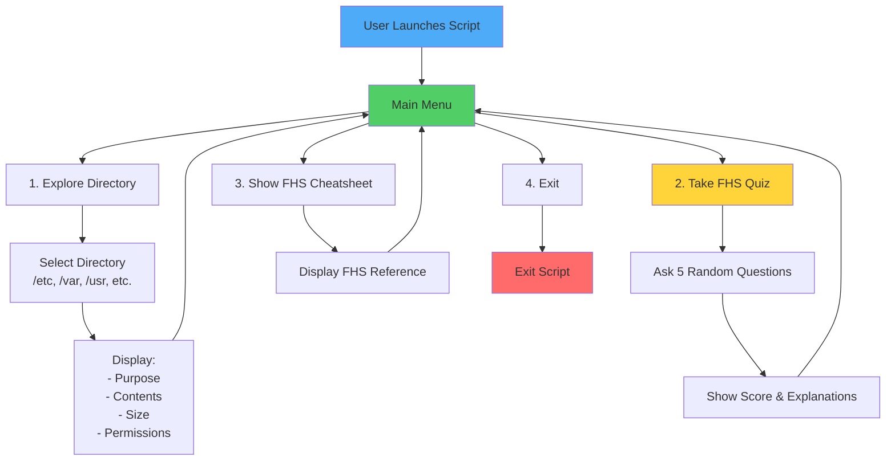

# Project 1: Linux System Explorer

> Interactive script that teaches Linux Filesystem Hierarchy Standard (FHS) through exploration and quizzes


---

## 📋 Project Overview

**Goal**: Build an interactive learning tool that helps users understand the Linux Filesystem Hierarchy Standard by exploring directories, viewing their purposes, and testing knowledge through quizzes.

**Learning-Focused**: This project prioritizes understanding over portfolio presentation. The skills learned here are foundational for all future Linux projects.

---

## 🎯 Learning Objectives

This project covers:

1. **FHS Structure**: Understanding the purpose of core directories (`/etc`, `/var`, `/usr`, `/home`, `/proc`, `/sys`)
2. **Bash Scripting**: Building an interactive CLI tool with menus and user input
3. **File Navigation**: Using commands like `ls`, `cd`, `find`, `tree` effectively
4. **Quiz Implementation**: Creating educational content that tests FHS knowledge

---

## 🛠️ Technical Skills Practiced

- **Bash scripting**: Functions, loops, conditionals, user input
- **File system operations**: Navigation, inspection, directory analysis
- **CLI design**: Interactive menus, colored output, user experience
- **Documentation**: Clear help text, usage examples

**Key Commands to Master**:

- `ls -lah`, `cd`, `pwd`
- `find`, `tree`, `du`
- `file`, `stat`, `readlink`

---

## 📐 Architecture



---

## 🚀 Quick Start

### Prerequisites

- Linux system (Ubuntu 22.04/24.04 or similar)
- Bash 4.0+
- Basic familiarity with terminal commands

### Installation

The project can be set up by cloning the repository and making the script executable:

```bash
git clone git@github.com:rizvawn/linux-system-explorer.git
cd linux-system-explorer
chmod +x system_explorer.sh
./system_explorer.sh
```

---

## 📚 Usage Examples

### Explore a Directory

The script allows directory exploration with detailed information:

```bash
./system_explorer.sh --explore /etc
# Output:
# 📂 /etc - System Configuration Files
# Purpose: Contains system-wide configuration files
# Size: 12 MB
# File Count: 456 files
# Sample contents: hosts, passwd, fstab, ssh/sshd_config
```

### Take FHS Quiz

The quiz mode presents interactive questions about FHS directories:

```bash
./system_explorer.sh --quiz
# Interactive quiz with 5 questions about FHS directories
# Shows score and explanations
```

### Show Cheatsheet

The cheatsheet displays a reference table of all major FHS directories:

```bash
./system_explorer.sh --cheatsheet
# Displays reference table of all major FHS directories
```

---

## 🧪 Testing

Basic tests validate script functionality:

```bash
./tests/test_explorer.sh

# Expected output:
# ✅ Script is executable
# ✅ Help text displays correctly
# ✅ All menu options work
# ✅ Directory exploration shows correct info
```

---

## 📂 Project Structure

```text
project-01-system-explorer/
├── README.md                   # This file
├── system_explorer.sh          # Main interactive script
├── lib/
│   ├── fhs_data.sh            # Directory descriptions and facts
│   ├── quiz.sh                # Quiz questions and logic
│   └── utils.sh               # Helper functions (colors, menus)
├── tests/
│   └── test_explorer.sh       # Basic validation tests
└── docs/
    ├── FHS_REFERENCE.md       # Complete FHS documentation
    └── LESSONS_LEARNED.md     # Post-project reflections
```

---

## 🎓 Key Directories to Understand

| Directory | Purpose | Example Contents |
|-----------|---------|------------------|
| `/etc` | System configuration | `passwd`, `fstab`, `ssh/` |
| `/var` | Variable data (logs, caches) | `log/`, `cache/`, `tmp/` |
| `/usr` | User programs & libraries | `bin/`, `lib/`, `share/` |
| `/home` | User home directories | `/home/rizwan/` |
| `/proc` | Process information (virtual) | `/proc/cpuinfo`, `/proc/meminfo` |
| `/sys` | Device & kernel info (virtual) | `/sys/class/net/` |
| `/tmp` | Temporary files | Cleared on reboot |
| `/boot` | Boot loader files | `vmlinuz`, `initrd` |
| `/dev` | Device files | `sda`, `tty`, `null` |
| `/opt` | Optional software | Third-party applications |

---

## 🔍 Implementation Approach

The project was designed in four phases:

### Phase 1: Basic Structure (2-3 hours)

- Main script with interactive menu system
- Directory exploration function
- Directory information display (purpose, size, sample files)
- Colored output for enhanced UX

### Phase 2: Quiz System (2-3 hours)

- Quiz question database
- Random question selection
- Score tracking and feedback mechanism
- Explanations for correct answers

### Phase 3: Polish & Documentation (2-3 hours)

- FHS cheatsheet reference
- Help text and usage examples
- Comprehensive README documentation
- Lessons learned documentation

### Phase 4: Testing & Validation (1-2 hours)

- Fresh system testing
- Menu option verification
- ShellCheck validation
- Feedback collection and iteration

---

## 🚧 Current Status

**Status**: Not Started  
**Started**: TBD  
**Completed**: TBD  
**Time Invested**: 0h / 8-10h estimated

---

## 📝 Notes & Considerations

### Why This Project is "Learning-Focused"

- **Low Portfolio Value** (⭐⭐☆☆☆): Basic FHS knowledge is expected, not impressive to employers
- **High Learning Value**: Essential foundation for all future Linux work
- **Integration Opportunity**: Consider merging this into a more advanced project later

### Potential Enhancements (Optional)

- 🔧 Add `--daemon` mode that quizzes you randomly throughout the day
- 🔧 Track quiz scores over time (progress tracking)
- 🔧 Generate visual tree diagrams of FHS structure
- 🔧 Include comparisons with Windows/macOS file systems

### What NOT to Spend Time On

- ❌ Complex TUI (curses/dialog) - stick with simple menus
- ❌ Configuration files - this is a simple script
- ❌ Database for quiz questions - use hardcoded arrays
- ❌ Multi-language support - focus on functionality

---

## 🎯 Success Criteria

**Minimum Viable Product**:

- ✅ Interactive menu with 3+ options
- ✅ Explore at least 5 core directories
- ✅ Quiz with 10+ questions
- ✅ Cheatsheet reference
- ✅ ShellCheck passes with 0 warnings

**Quality Gates**:

- ✅ Script executes without errors
- ✅ Help text is clear and useful
- ✅ Code is readable and well-commented
- ✅ README documents all features

---

## 🔗 Resources

### Official Documentation

- [Filesystem Hierarchy Standard](https://refspecs.linuxfoundation.org/FHS_3.0/fhs/index.html)
- [Linux man pages](https://man7.org/linux/man-pages/)

### Useful Tools

- `tree` - Visualize directory structures
- `ncdu` - Disk usage analyzer
- `shellcheck` - Bash linting

### Similar Projects (for inspiration)

- [explainshell.com](https://explainshell.com/) - Command explanation tool
- [tldr pages](https://tldr.sh/) - Simplified man pages

---

## 📄 License

MIT License - See LICENSE file for details

---

## 🗓️ Changelog

### 2025-11-25

- Project initialized
- README created
- Ready to begin Phase 1

---

**Development Roadmap**:

The project development follows these phases:

1. Main script (`system_explorer.sh`) with menu system
2. Directory exploration functionality
3. Quiz implementation and testing
4. Documentation and validation

*This project is part of the [Linux Portfolio Roadmap](../../ROADMAP.md) - Tier 1: Fundamentals*
